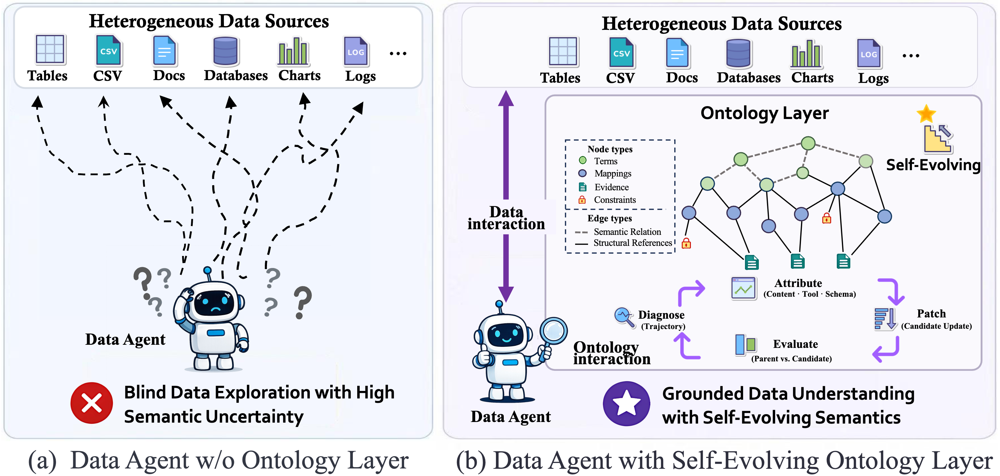
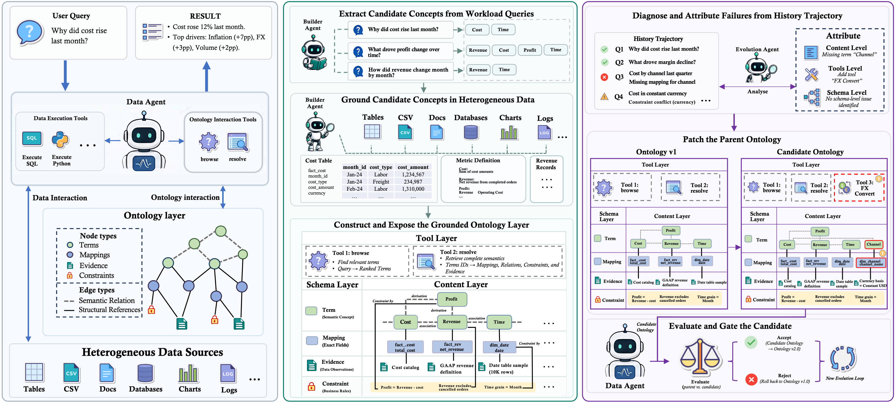

<p align="center">
  
</p>

<h1 align="center">EvoOntology: A Self-Evolving Ontology Layer for Data Agents</h1>

[](https://arxiv.org/abs/2510.16872)
[](https://github.com/ruc-datalab/EvoOntology)
[](https://github.com/ruc-datalab/EvoOntology/tree/master/plugins/evoontology-codex)
[](https://github.com/ruc-datalab/EvoOntology/tree/master/plugins/claude-code) <a href="README.md">English</a> | <a href="README.zh-CN.md">简体中文</a>

> **Authors:** [Meiduo Chong](https://github.com/MeiduoChong), [Shaolei Zhang](https://zhangshaolei1998.github.io/)<sup>*</sup>, [Ju Fan](https://iir.ruc.edu.cn/~fanj/), [Xiaoyong Du](https://info.ruc.edu.cn/jsky/szdw/ajxjgcx/jsjkxyjsx1/js2/7374b0a3f58045fc9543703ccea2eb9c.htm)<br>
> Renmin University of China<br>


EvoOntology bridges the **agent-data gap** over heterogeneous tables, files, and databases. It exposes a versioned **Ontology Layer** through MCP tools, grounds that layer in real workload evidence, and continuously adapts it from execution trajectories.

## Why EvoOntology

- **Raw data leaves semantics implicit.** Table names, columns, file paths, and isolated observations rarely explain metric definitions, entity relationships, or business constraints. Agents must infer them repeatedly and are prone to semantic errors.
- **Static semantic layers do not scale with use.** Hand-authored layers require sustained expert maintenance, become stale as data and workloads change, and consume increasing context when injected in full.
- **Agents need semantics that can adapt.** EvoOntology provides a workload-grounded Ontology Layer that agents query on demand and that evolves from observed execution behavior under controlled evaluation.

<p align="center">
  
</p>

<p align="center"><strong>An agent-first, self-evolving ontology layer for Data Agents.</strong></p>


## Demo

The plugin for codex and Claude Code, creates and evolves your ontology layers on your data.

<p align="center"><strong>An agent-first, self-evolving ontology layer for Data Agents.</strong></p>

## Highlights

### Problems We Address

- **Semantic uncertainty.** Make domain concepts, data mappings, relationships, and constraints explicit instead of leaving agents to guess from raw sources.
- **Repeated data exploration.** Reuse grounded knowledge across tasks so agents can focus on relevant data rather than rediscovering the environment for every request.
- **Costly semantic maintenance.** Adapt the Ontology Layer to changing workloads and agent behavior while keeping updates inspectable, comparable, and reversible.

### Design Highlights

- **Active, on-demand access.** Agents retrieve only the semantics relevant to the current step through MCP tools, rather than receiving the entire layer in every prompt.
- **Evidence-grounded construction.** The initial ontology is built around the workload and verified against the underlying data sources.
- **Trajectory-grounded evolution.** Historical interactions reveal limitations and guide localized updates across the interconnected Content, Schema, and Tool Layers.
- **Controlled versioning.** A Candidate is published as the next ontology version only after paired evaluation shows a reproducible improvement over its Parent.
- **Direct agent integration.** The plugin connects the ontology workspace and MCP runtime to supported agents after installation and session restart.

## How It Works

EvoOntology treats the Ontology Layer as trainable agent state—not model weights. A builder initializes grounded semantic objects from the workload and underlying data; an evolution agent then uses historical interactions to propose bounded updates and validates every Candidate against its Parent.

<p align="center">
  
</p>

### The Ontology Layer

Three interconnected layers define the ontology's knowledge, representation rules, and runtime access:

| Layer | Role |
| --- | --- |
| **Content Layer** | A typed semantic graph with four node families: Terms, Mappings, Constraints, and Evidence. Semantic Relations connect Terms, while Structural References link Terms to Mappings and attach Constraints or Evidence to the objects they govern or support. |
| **Schema Layer** | Defines the fields of the four node families, the allowed Semantic Relation types, and the permitted Structural Reference patterns, thereby setting the ontology's representational boundaries. |
| **Tool Layer** | Exposes the ontology through `browse_semantics`, `resolve_semantics`, and a compact session manifest. The manifest initializes the session; detailed records and linked objects are retrieved on demand. |

### Lifecycle

1. **Build** — derive candidate concepts from the workload, verify them against raw sources, and publish `ontology_v0`.
2. **Use** — let the Data Agent query the Ontology Layer on demand while its tool interactions and outcomes are recorded.
3. **Evolve** — diagnose recurring behavior, attribute it to Content, Tool, or Schema, and produce a localized Candidate patch.
4. **Evaluate** — compare Parent and Candidate with the same data, agent, decoding settings, and interaction budget.
5. **Publish or reject** — publish the passing Candidate as `ontology_vN+1`; otherwise retain the Parent and use the result in the next round.

## Quick Start

Install the plugin from the GitHub marketplace—no repository clone, virtual environment, or separate `pip install` is required.

### Claude Code

```bash
claude plugin marketplace add MeiduoChong/EvoOntology
claude plugin install evoontology@evoontology
claude plugin list
```

Start a new session, then run:

```text
/evo-build
/evo-evolve
/evo-visualize
```

### Codex

```bash
codex plugin marketplace add MeiduoChong/EvoOntology
codex plugin add evoontology-codex@evoontology
codex plugin list
```

Start a new thread, then ask Codex to use:

```text
$evo-build
$evo-evolve
$evo-visualize
```

Once built, the Data Agent can call `browse_semantics` and `resolve_semantics` without additional ontology configuration. See the [usage guide](USAGE.md) for the full workflow and data boundaries.


## Benchmarks

EvoOntology includes self-contained adapters for three complementary Data Agent settings:

| Benchmark | Task | Directory |
| --- | --- | --- |
| BIRD | Text-to-SQL over real-world databases | [`benchmarks/bird/`](benchmarks/bird/) |
| DDR-10K | Open-ended research over heterogeneous financial data | [`benchmarks/ddr_10k/`](benchmarks/ddr_10k/) |
| InsightBench | Iterative business analysis and insight generation | [`benchmarks/insightbench/`](benchmarks/insightbench/) |

Each environment implements an `EvolutionAdapter` and preserves its native rollout and evaluation protocol. List registered environments with `python -m benchmarks list`; see [Adding a benchmark](docs/guide/new-benchmark.md) for the integration contract.

## Repository Layout

| Path | Purpose |
| --- | --- |
| [`evoontology/`](evoontology/) | Deterministic core: ontology store, runtime/MCP, trajectories, triggers, evaluation, evolution state, validation, and visualization. |
| [`plugins/`](plugins/) | Self-contained Claude Code and Codex plugins with Build, Evolve, and Visualize skills. |
| [`benchmarks/`](benchmarks/) | BIRD, DDR-10K, and InsightBench evaluation environments. |
| [`docs/`](docs/) | Architecture and benchmark-integration documentation. |
| [`scripts/`](scripts/) | Core-to-plugin synchronization utilities. |

## Documentation

- [Usage guide](USAGE.md) — installation, workspace, lifecycle, configuration, and end-to-end operation.
- [Architecture](docs/architecture.md) — module boundaries, evolution state machine, and evaluation modes.
- [Add a benchmark](docs/guide/new-benchmark.md) — adapter, data loader, rollout, configuration, and seed-skill contract.
- [Claude Code plugin](plugins/claude-code/README.md) and [Codex plugin](plugins/evoontology-codex/README.md) — client-specific installation and usage.

## 🖋 Citation

If this repository is useful for you, please cite as:

```

```

If you have any questions, please feel free to submit an issue or contact `zhangshaolei98@ruc.edu.cn`.
